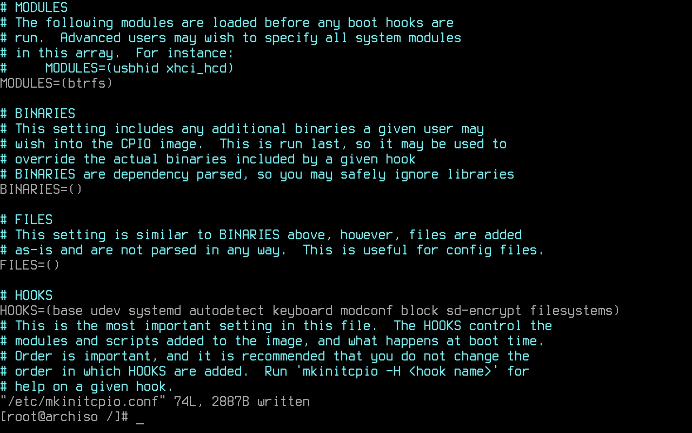
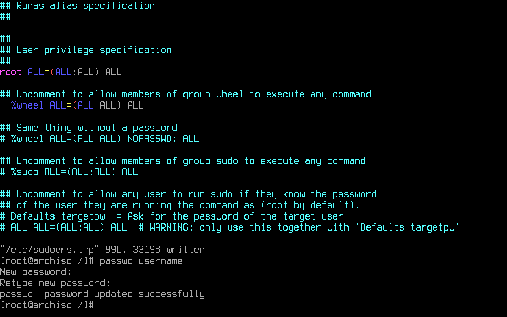
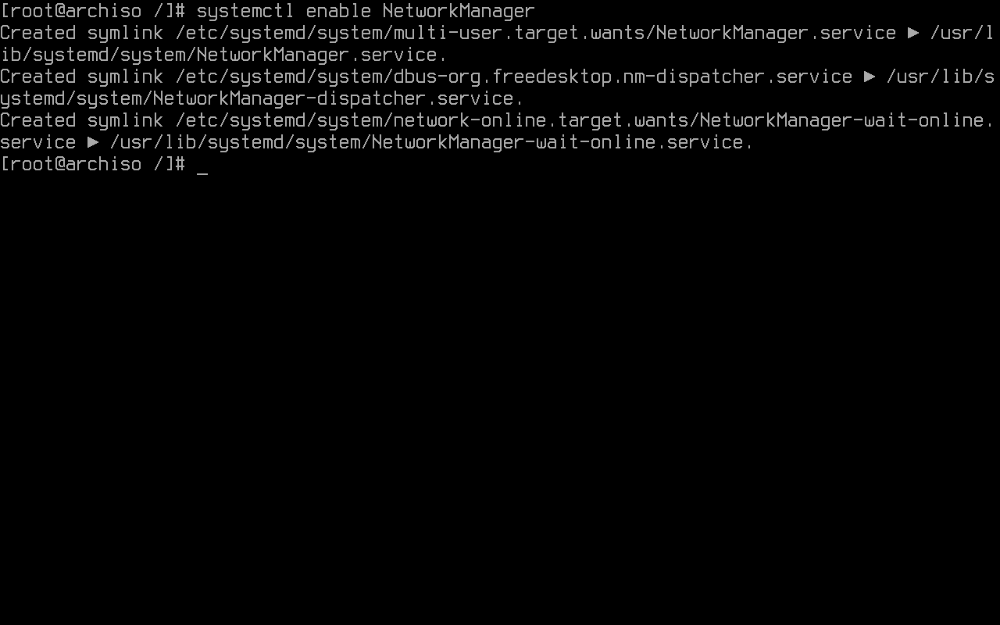
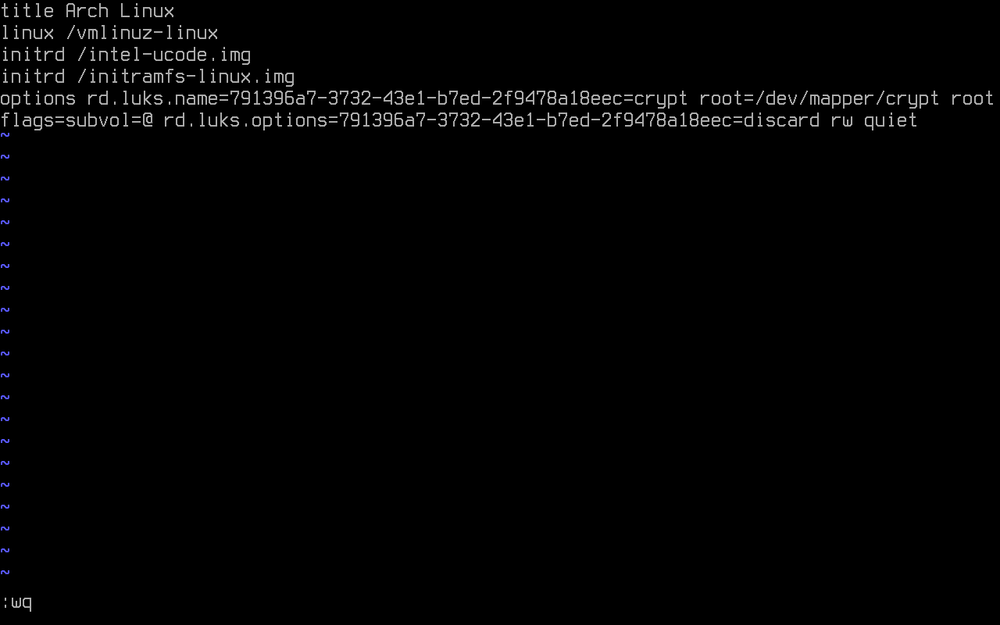
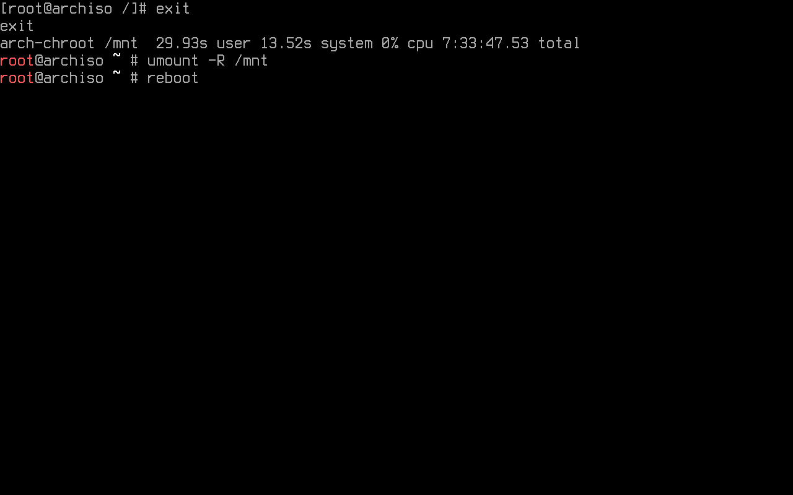

# Barebones

## Installation

### Mirrors selection

Packages are downloaded from [mirror servers](https://wiki.archlinux.org/title/Mirrors).
[Reflector](https://wiki.archlinux.org/title/Reflector) updates the mirror list by 20 most 
recently synchronized HTTPS mirrors and sorting them by download rate after connecting to the
internet on the live system.

The higher a mirror is placed in the list, the more priority it is given when downloading a package.
Usually, the one generated on the live system is fine. If not, it may be [edited](https://wiki.archlinux.org/title/Help:Reading#Append,_add,_create,_edit).


### Essential packages installation

[Pacstrap](https://wiki.archlinux.org/title/Pacstrap) is designed to create a new system installation from scratch.
It is used to install specified packages into a given directory after setting up the mountpoints defined before
(specifically into the root partition).

**Optional**: ```base-devel``` , ```vim```, ```intel-ucode```, ```amd-ucode```

```
pacstrap /mnt base base-devel linux linux-firmware btrfs-progs vim intel-ucode
```

## System configuration

### Fstab

The [fstab](https://wiki.archlinux.org/title/Fstab) file can be used to define how disk partitions, various other block 
devices, or remote file systems should be mounted into the file system. An fstab file is generated with:

```
genfstab -U /mnt >> /mnt/etc/fstab
```


### Chroot

A chroot is an operation that changes the apparent root directory for the current running process and their children.
The following command changes root into the new system:

```
arch-chroot /mnt/
```

### TIme-zone

By running the following command, an ```/etc/localtime``` symlink that points to a zoneinfo is created. If the user's
time zone name is unknown, it is recommended to play around by looking at the zoneinfo directory content (e.g. 
```ls /usr/share/zoneinfo/```) to see which option is best suited. Replacing Region and City is necessary:

```
ln -sf /usr/share/zoneinfo/Region/City /etc/localtime
```

[Hwclock](https://man.archlinux.org/man/hwclock.8) is an administration tool for the time clocks. The following command
sets the Hardware Clock from the System Clock and updates the timestamps found in /etc/adjtime:

```
hwclock --systohc
```

### Localization

To make use of the english language in the system, ```en_US.UTF-8 UTF-8```  found in ```/etc/locale.gen``` must be uncommented.

```
vim /etc/locale.gen
```
By using [echo](https://man.archlinux.org/man/echo.1), it is possible to edit/create a file without having to use a text editor. 
This command creates a locale.conf file and sets the LANG variable to the same uncommented above:

```
echo LANG=en_US.UTF-8 > /etc/locale.conf
```

The locales are generated by running:

```
locale-gen
```


### (Optional) Persistent keyboard layour

```
echo KEYMAP=la-latin1 > /etc/vconsole.conf
```

### Network configuration

The following command creates the hostname file an adds the system's hostname. 
In this example, ```myhost``` is the hostname:

```
echo myhost > /etc/hostname
```

```
vim /etc/hosts
```


### Initramfs

```
vim /etc/mkinitcpio.conf
```

- `base`: provides crucial runtime necessities for booting.

- `udev`: adds the udev daemon to the initramfs, allowing for dynamic loading of modules and reliable detection of 
the root device via tags (UUID).

- `systemd`: installs a basic systemd setup in the initramfs, and is meant toreplace the 'base', 'usr', 'udev' 
and 'resume' hooks. Other hooks with runtime components will need to be ported, and will not work as intended. 
Including ```base``` hook before this one to ensure that a rescue shell exists on the initramfs is a good idea.

- `autodetect`: shrinks the initramfs to a smaller size by autodetecting the needed
modules.

- `keyboard`: loads the necessary modules for keyboard devices.

- `modconf`: installs modprobe configuration files from /etc/modprobe.d and
/usr/lib/modprobe.d.

- `block`: loads the necessary modules for most block devices using pata, sata,
scsi, firewire, usb, or mmc.

- `sd-encrypt`: allows for an encrypted root device with systemd initramfs.

- `filesystems`: adds filesystems modules to the image.



```
mkinitcpio -P
```


### Password creation

```
passwd
```

### User creation

```
useradd -mG wheel username
```

```
 EDITOR=vim visudo
```

```
%wheel ALL=(ALL) ALL
```

```
passwd username
```



```
pacman -S linux-headers networkmanager dialog wpa_supplicant mtools dosfstools git xdg-utils xdg-user-dirs
```

```
systemctl enable NetworkManager
```



## Bootloader

### Systemd-boot as bootloader

```
 bootctl --path=/boot install
```


```
 echo $(blkid -s UUID -o value /dev/sda2) >> /boot/loader/entries/arch.conf
```


```
vim boot/loader/entries/arch.conf 
```


```
vim /boot/loader/loader.conf
```


## Reboot

```
exit
```

```
umount -R /mnt
```

```
reboot
```

