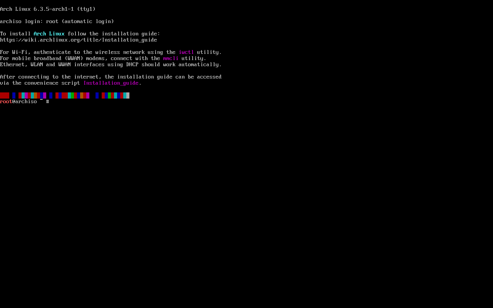

# Pre-Installation

## The very first thing

This guide illustrates the installation process on a virtual machine. Every command and code snippet will be presented 
within code elements for easy identification and differentiation from regular text, such as this one:
```
This is a code element
```
This allows the reader to conveniently use the commands without ever reading all of these words (although 
it is not recommended).


### Installation image

In order to obtain an installation image, it is suggested to download an ISO file via HTTP 
from one of the mirror sites listed on the [Arch Linux HTTP Direct Downloads](https://archlinux.org/download/).
It is recomended to verify the ISO signature to make sure it is [safe to use](https://www.theregister.com/2016/02/21/linux_mint_hacked_malwareinfected_isos_linked_from_official_site/).

Once the site of choice has been selected, it greets with an index that contains the needed files. 


Downloading the ISO file and one of the checksum txt files is necessary to see if the image matches the checksum.


It does! The SHA256 checksum can also be seen on the official website.

If the reader is _extra_ paranoid, the ISO PGP signature (the iso.sig file also found on the index) can be downloaded 
in the same directory and verified (assuming that [GnuPG](https://www.gnupg.org/), a libre encryption tool is already 
installed) with:

```sh
gpg --keyserver-options auto-key-retrieve --verify archlinux-version-x86_64.iso.sig
```


It is. It also matches the key fingerprint of the [Arch Linux Developer who signed the ISO](https://archlinux.org/people/developers/).


### Installation medium preparation

Archmoured assumes that the reader already knows how to prepare an installation medium and boot from a live environment.
It could be said that it is left as an exercise.

> Protip: Use [Ventoy](https://www.ventoy.net) to get the most out of your installation media (most likely an USB drive). 

## Into the live environment

Once booted, a shell prompt is presented.



### (Optional) Set console font

Those small characters may not be to everyone's liking. In order for the screenshots to be readable, a larger font has been
selected. 


Console fonts can be found in ```usr/share/kbd/consolefonts/``` and set with [setfont](https://man.archlinux.org/man/setfont.8).


### (Optional) Set console keyboard layout

The default console keymap is [US](https://en.wikipedia.org/wiki/File:KB_United_States-NoAltGr.svg). All available layouts can be found in ```/usr/share/kbd/keymaps```. For example's sake this guide will show how to set up the [Latin American](https://commons.wikimedia.org/wiki/File:KB_Latin_American.svg) layout. 
To list all the available keymaps, the command ```locatectl list-keymaps``` is used. [Grep](https://www.gnu.org/software/grep/manual/html_node/index.html) can also be handy when searching for a more specific result. Searching for this specific keymap can be done with:


```
localectl list-keymaps | grep -i la
```

Once located, it can be set up for the current session. This is done by using [loadkeys](https://man.archlinux.org/man/loadkeys.1).
To set the already located layout, the following command is used:

```
loadkeys la-latin1
```


And there it is!

### Boot mode verification

### Internet connection

### System clock configuration

### Disk partitioning

### Partition formatting

### Partition mounting

### Partition verification
