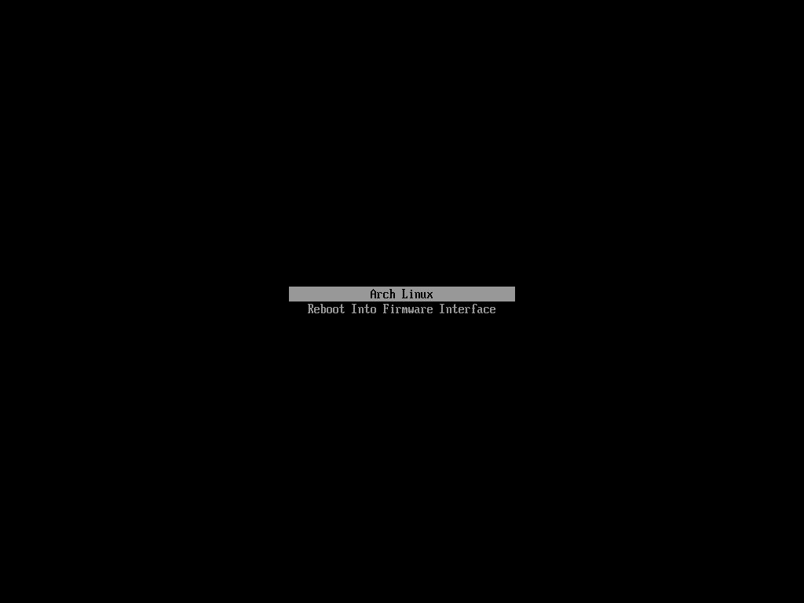

# Post-Installation




## Snapshots

```
cd
sudo pacman -Syu
```


```
cd Downloads/
sudo pacman -S go
git clone https://aur.archlinux.org/yay.git
cd yay/
makepkg -i
```


```
yay -S timeshift
sudo timeshift --create --comments "Testing..."
sudo timeshift --list
```


```
sudo pacman -S cowsay
```


```
sudo timeshift --restore
```


```
reboot
```


## Graphical User Interface

There it is. A minimal install. For desktop use, it is highly recomended to use a graphical
environment. Choosing one can be a true hassle. For this, virtually any guide suffices 
since this distro is well-known for its ricing community. For now, Archmoured encourages the 
usage of [Xfce](https://wiki.archlinux.org/title/Xfce), for it brings a truly stable 
experience.